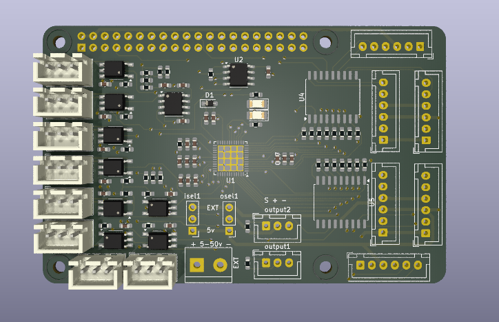
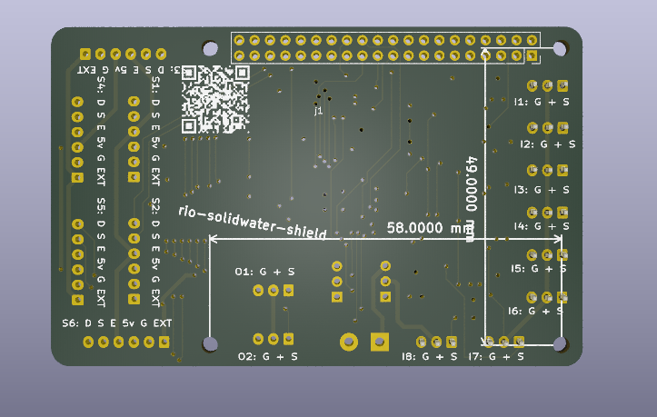

# rio-SolidWater-Sheild
6 Axis LinuxCNC-RIO Raspberry-PI FPGA-Hat based heavily on rio-IceShield, designed for stepper motors.
**experimental**

Nearly a 100% pin compatible rework of the rio-iceshield using single sided SMD, so that it can be inexpensively manufactured by JLCPCB or other parts fab houses. Some parts have been changed to parts that are available through the fab house, so that all SMD components can be assembled at the fab house.

Maximum step rate is theoretically 500khz due to the minimum rise and fall time of the  though this has not been tested much more than 





## Hardware

- Tested on a Raspberry Pi 4b with the Touchy and Axis UIs. Axis is a bit slow for a pi4 though, I recommend only using it for initial calibration and trying Touchy or another UI.
- If you don't use it on a Pi 4b, you will have to provide a 5mhz clock signal on the pi GPIO header pin 7.
- The 24v power jack is ONLY for input, output, and stepper connections, it will not power the board or pi. You can supply any voltage you wish on there, up to a maximum of 50v, which is the limit of the ULN2803A line driver.
- You can select if the inputs and outputs (not including stepper outputs) supply 5v from the pi or external power from the jack labelled 24v through the isel1 jumper. Short the middle pin to either the top or bottom pin, labelled on the top side of the board. Both 5v and external power is available on all stepper headers. 
- The connectors used are JST-XH 2.54mm pitch. Any 2.54mm or 0.1" pitch connector or pin header will work.

## software / gateware
Requires:
https://github.com/multigcs/riocore

## Ordering:

Production output files are provided in the Production-Outputs directory. JLCPCB required a few small replacements due limits in stock, so the parts that were selected during the assembly step are included in bom.xls, and bom.xls should be able to be uploaded to JLCPCB directly during the assembly ordering step. Select ONLY the top side for assembly, and Economy assembly is fine. The positions.csv is included as well.

Don't be alarmed if during the parts placement confirmation step the parts appear rotated, the fab house will place them in their correct orientation. It's recommended to select "Confirm Parts Placement" so they can send you the generated final placement once they've analyzed it. The parts that I either could not see or needed to fix in the ordering preview ended up corrected when they emailed me the production file before production started.

The gerber files are in the zip file in the same directory. It is a 4 layer board.

There is a minimum pcb order of 5 and a minimum assembly order of 2, and production and assembly cost for me was approximately $50 CAD for 2 boards in 2024. You end up with 3 spare unpopulated boards to use as coasters!

## Usage:

- Setup a https://github.com/multigcs/riocore as normal according to the instructions there.
- Copy the riocore/config/IceShield/config.json
- Generate and compile the config.
- Navigate to the Output dir, and run sudo ./spiflash.sh ./rio.bin
If successful, you probably will see a solid green light on the board.
If not, you may need to add yourself to appropriate SPI groups, or enable SPI on the raspberry pi you're using. Post an issue here if you have trouble with this, I likely have details available on my reference hardware.
This requires a clock signal from the raspberry pi on GPIO header pin 7. There are a few ways to do this, but I did it by installing the WiringPi tooling https://github.com/WiringPi/WiringPi and then executing
```
gpio mode 7 clock
gpio clock 7 5000000
```
You may add this to your Output/IceShield/LinuxCNC/start.sh to automate this.
If that was successful, the green LED should start blinking, assuming your config has the default "blink" plugin setup.

Proceed to setup LinuxCNC as normal according to https://github.com/multigcs/riocore

## Forum
English: https://forum.linuxcnc.org/18-computer/49142-linuxcnc-rio-realtimeio-for-linuxcnc-based-on-fpga-ice40-ecp5

## Derived From
https://github.com/multigcs/rio-iceshield